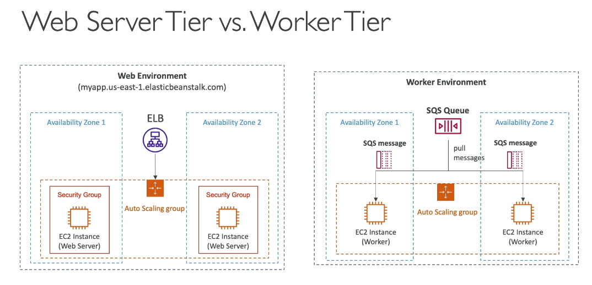

# Solutions Architectures Overview

In these notes we consider some basic scenarios for application design.
Overall, for every design you should consider:

- Costs
- Performance
- Reliability
- Security
- Operational Excellence/Simplicity

## 1. Stateless WEB APP
The APP:
- the user wants to know the time
- the app will return the time

Requirements:
- No database need
- downtime accepted
- Ability to scale vertically (e.g. from m3 to m5) or ability to scale horizzontally (from 1 to 3 instances) with no downtime    

#### Possible Solution (in order of increasing complexity):
  - multiple elastic IPs (users need to know the IPs)  - not really doable (you have limited EIP)
  - multiple DNS records load balancing to the different resources; this is still not great: because of TTL users can  
    try to access resources that are down or do not exist
  - one ELB with one DNS (alias) record pointing to a target group with a set of resources. Security groups are implemented to allow traffic to EC2 instances only from the ELB.
  - one ELB with one DNS (alias) record pointing to a target group with autoscaling. Security groups are implemented to allow traffic to EC2 instances only from the ELB.
  - one ELB (multi AZ) with one DNS (alias) record pointing to a target group with autoscaling with EC2 instances in different AZ. Security groups are implemented to allow traffic to EC2 instances only from the ELB. 
  - one ELB (multi AZ) with one DNS (alias) record pointing to a target group with autoscaling with EC2 instances in different AZ with reserved capacity to save money (at least one EC2 instance in 2 different AZs). Security groups are implemented to allow traffic to EC2 instances only from the ELB.

## 2. Stateful WEB APP
The APP:
- the app allows to buy clothes online
- there is a shopping cart and the user session is tracked/stored

Requirements:
- website serves hundreds of users at the same time
- Needs to scale horizzontally
- web part needs to be as stateless as possible
- users must not lose their shopping cart
- users must have their details in DB

#### Possible Solution:
We start from an application deployed as in **#1**, i.e. ELB with DNS record in route 53. Target group with autoscaling and EC2 instances in different AZs, security groups etc..  
We need to add persistence and session track so we could have:

  - stickyness could be added to the ELB if the state is kept in the app (if a server goes down however, user session is lost)
  - shopping content could be stored in cookies on the client side however HTTP requests however get heavier and they would need to be validated (they could be modified in transit)
  - instead of sending the content of the cart we could have a cookie for session_id. the content of the cart is stored in Elasticache. The EC2 running the app will recover the content from Elasticache (or DynamoDB as alternative).  
    It's more secure and has high performance. User data should be stored instead in an RDS, still accessible from all EC2 instances 
  - Reads need to scale so we could have a reader endpoint with multiple Read replicas for RDS or we could use the cache instead (**Lazy Loading**); in this case, the first time the app will have a **cache miss** trying to get the user info from the cache. It will read the info from RDS and then save in the cache (with TTL). The second time the app looks for the user info they will get a **cache hit** and get the data from there
  - Now we want to be able to survive disasters so we can add Multi AZ ELB, Multi AZ scaling group, Multi AZ Elasticache (Redis) and Multi AZ RDS (or DR standby only).
  - Security groups are:
    - open http/https for ELB
    - traffic from LB only for EC2 instances
    - traffic from EC2 instances only for Elasticache and RDS

## 3. Stateful WEB APP: wordpress (shared storage)
The APP:
- the app should access and display picture uploads
- User should be able to post content

Requirements:
- Data and user post content is stored in MySQL DB (pictures are not)

#### Possible Solution:
Again we start with a basic Multi AZ ELB and a single EC2 instance with EBS storage volume. The images are saved and
read from the single EBS volume. We could use Aurora(MySQL) as it's easier to scale and upgrade.
- We scale to more EC2 instances; now images can't be stored in the local EBS volumes or the user might not get it if 
  they are forwarded to a different EC2 instance. We **replace EBS** with **EFS** the storage is now shared between the different EC2 instances (they will all need an ENI in the EFS VPC)

## 4. Installing Applications quickly
EC2 instances can:
-  have a **golden AMI**: you spin up a vanilla AMI, set it up as you want and save it as a **golden image**. You can use it later to spin up directly
-  Bootstrap the instance with **User Data**: you can run custom scripts so that the instance is dynamically configured
- Hybrid: mix Golden AMI and User Data (**Elastic Beanstalk**)

RDS instances can:
- restore from a snapshot: the database will have schema and data already

EBS volumes can:
- restore from a snapshot: the disk will be formatted and have the data already 

## 5. Beanstalk overview
Beanstalk is a developer centric view of deploying an application on AWS. It's free on its won but you'll pay (of course)
for the resources you create. There are a few deployment modes:
 - single instance with Elstic IP, EC2 instance and RDS Master and
 - High availability with ALB, autoscaling target group Multi AZ and Multi AZ RDS Master/Sandby   
 - Custom: completely custom
 - etc..

Beanstalk can use all the components we have seenand it is a managed service and automtically handles:
- capacity provisioning
- load balancing
- scaling,
- application health monitoring
- instance configurations
- etc..  

It uses cloud formation to crate resources behind the scenes (you can check the stack cretead by beanstalk in the cloud formation service page) and you can view the architecture in the template page (cloud formation) under: **View in Designer**

#### Components:
An Application is the high level container and  it's made up of a collection of Elastic Beanstalk components:
- **Application version**: an itertion of (your) application code
- **Environment**: set of AWS resources running an application version (only one version at a time). you can create multiple environemtn(dev,test,prod, etc..)
- **Tiers**:  
  - `Web Server Environment Tier`: made by a ELB and Autoscaling group with multi AZs EC2 instances
  - `Working Environment Tier`: An SQS queue is used to exchange messages. The workers in the EC2 will pull/push messages from the queue. The Web Tier will interact with the queue and not directly with the workers

The process is:
 - Create an application: this gives a choice of which environemnt create
 - Upload Version (code)   -> possibly deploy a new version on an existing environment
   Beanstalk supports different programming language and you need to select one when you create an application and load the code.
 - Launch the Environment
 - Manage the Environment -> possibly update the version

 In the events tab you can see all the logs related to the resource creation etc..
 The domain name (url) to access the environemnt will be returned at the end in the Application page once everything is created. If you follow the link you will be sent to the application front end.
 

Notes:
You need to create a role for EC2 instances created by BEanstalk; the role needs to have beanstalk permissions policies (at least BeanstalkWebTier,BeanstalkWorkerTier,BeanstalkMulticontainerDocker) 

 