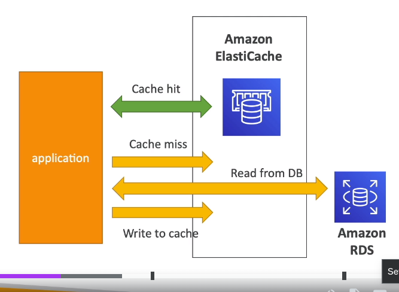

# ElastiCache Overview

- This gets a managed **Redis** or **MemCached**.
- Caches are in-memory databases with really high performance and low latency
- Helps reduce load off databses for read intensive workloads (common queries are going to be cached)
- Makes your applications tateless by keeping the state in AWS
- AWS takes care if IS maintenance/patching
- Using ElasticCache involves heavy changes to the actual application codes
- The cache needs to have a **invalidation strategy** to make sure only the most current data is used
- You can also store the user session, the application should retrieve the user session from Elasticache. 
It works as follows:
 - application queries the cache first
   - if the the data is present we have a **cache hit**
   - if the data is not present we have a **cache miss**
 - if we have cache miss, the app needs to query the DB
 - writes will go to the Cache
 - same as for RDS you have reader endpoint and writer endpoint

   

## ElasticCahce Redis vs Memcached
**Redis** supports (similar to RDS in a way):
 - Multi AZ with auto failover
 - read replicas to scale reads and have high availability
 - **Data durability** using AOF persistence (Append Only File: every write command is appended here)
 - **Backup and Restore features**
 - Supports sets and sorted sets
 - support IAM Authentication (IAM policies are only used for AWS API-level security)
 - it also supports Redis Auth with a password/token (need to select this when creating the cluster)

**Memcached** supports:
 - Multi node for partition of data (Sharding)
 - No high availability (replication)
 - No persistence,backup and restore
 - Multi Thread architecture
 - does not support IAM Authentication but supports SASL-based authentication (advanced)

 

## Patterns to Load Data into the Cache
**Lazy Loading**: all the read data is cached , data can become stale in the cache.  
when you have a cache miss, you load the data from the cache and you write to the cache
**Write Through**: adds or update data in the cache when written to a DB (no stale Data).  
**Session Store**: store temporary session data in cache and use a TTL feature.  

## Redis Use Case
- Gaming Leader Board: use Redis Sorted Sets; they allow to store a collection of unique elements while assigning a score/rank to each element  
  Every time a new element is added, it's ranked in real time and then added in the correct order (so you don't need to do that inside the application)
  

## List of Ports to know for RDS/Redis etc..
General ports:
- FTP: 21
- SSH: 22
- SFTP: 22 (same as SSH)
- HTTP: 80
- HTTPS: 443

RDS Databases ports:
- PostgreSQL: 5432
- MySQL: 3306
- Oracle RDS: 1521
- MSSQL Server: 1433
- MariaDB: 3306 (same as MySQL)
- Aurora: 5432 (if PostgreSQL compatible) or 3306 (if MySQL compatible)

