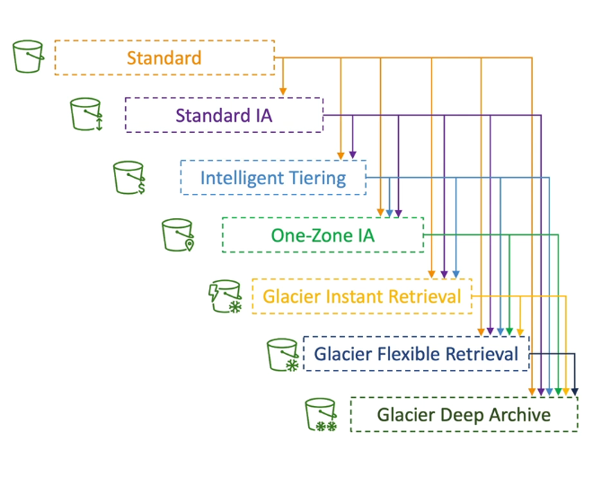

# S3 Overview

Advertised as infinite scaling storage. 

# Buckets
Stores file into **Buckets** (that are seen as **Directories** but are not).  
Even if buckes are `defined at the region level`, Buckets `must have a globally unique name` (across all regions all accounts)
Naming Convention:  
 - No Uppercase, No underscore
 - 3-63 characters long
 - Not an IP
 - Must start with lowercase letter or number
 - Must NOT start with prefix `xn`
 - Must NOT end with suffix `-s3alias`

Use cases:
 - Backup and storage
 - Disaster recovery
 - Archive
 - Hybrid Cloud Storage
 - Application Hosting
 - Media Hosting
 - Data Lakes and Big Data analytics
 - Software delivery
 - Static Websites 

Once you create a Bucket it's going to be empty; you can see your buckets from all regions in the dashboard and if you select one you can start yo upload files into the bucket and you will see under the **Bucket Objects**

## Objects
Files have a Key that is **the full path**: `prefix + object name`; Note: **there are no folders** even if they have `/` and look like path, these are keys and not folders  
E.G.  
s3://my-buket/my_folder/another_folder/my_file.txt 

The url (above) for the objects is visible in the object property page.
If you open the S2 url from the S3 page you will open the pre-signed url (including credentials) so you will be able to actually get the file.
If you copy the object (public) url and try to open it in a browser you will get instead an **Access Denied** by default (until you change the access policies) 

The object value are the content of the body; 
Max size is **5TB** (i.e. 5000GB) and if uploading more than **5GB**, you must use "**multi-part upload**"

The object also has:
-  **metadata** can be used/set by the system or by users.  Metadata is a list of text key / value pairs
-  Tags (unicode key /value pair - up to 10) useful for security / lifecycle
-  Version ID (if versioning is enabled)

## S3 Security
**User-Based**: you can use IAM policies to control which API calls should be allowed for a specific user/role from IAM  

**Resource-Based**: 
 - **Bucket Policies**: these are bucket wide rules created/associated from S3 console and allow access to specific objects fro specific accounts (e.g. used to make buckets pubblic)
 - Object Access Control List (ACL): finer grain control (can be disabled)
 - Bucket Access Control List (ACL): less common, finer grain control at bucket level (can be disabled) 

Note: an IAM principal can access an S3 object if the user IAM permissions ALLOW it **or** the resource policy ALLOWS it AND there is no explicit DENY

Encryption: you can and should enable Encryption for data saved in S3

#### S3 Bucket Policies
These are JSON based policies, e.g.
```
{
    "Version": "2012-10-17",
    "Id": "ExamplePolicy01",
    "Statement": [
        {
            "Sid": "ExampleStatement01",
            "Effect": "Allow",
            "Principal": {
                "AWS": "arn:aws:iam::123456789012:user/Akua"
            },
            "Action": [
                "s3:GetObject",    # <- applies to object in the bucket so need the /* in the resource list
                "s3:GetBucketLocation",
                "s3:ListBucket"   # <- applies to the "folder" so does not needd the /* in the resource list
            ],
            "Resource": [
                "arn:aws:s3:::awsexamplebucket1/*",
                "arn:aws:s3:::awsexamplebucket1"
            ]
        }
    ]
}
```
Blocks:
**Resources**:  what buckets and objet does the policy apply to; the '*' represents all objects at that level (and nested?)  
**Effect**: ALLOW or DENY, related to the **Action** section  
**Action**: Set of actions regulated by this policy  
**Principal**: Entity (account or user) to apply the policy to; if this is  `*` it means everyone, i.e. this is a public policy 

Note: There are bucket settings for `Block Public Access`; if they are enabled, even if you have a policy to allow public access, the S3 bucket will not be publicly available; (they can also be set at the account level to be sure they are applied every time)  

Example:
- You can use a policy to force files to be encrypted at upload
- Create a policy for a specific user to access S3 (IAM policy) or a role for an EC2 instance
- Bucket policy to allow cross account access (e.g. for an IAM user from other accounts)

## S3 to create static websites
S3 can be used to host static websites and have them accessible on the Internet; the url will be something like:
```http://bucket-name.s3-website.aws-region.amazonaws.com ```
It will point directly to the html file directly (other internallinks to further S3 objets can be done inside the HTML code).  
Of course it needs to set: **Allow Public Reads** with an S3 bucket policyor you will get **403 Forbidden Error**

A specific setting for Static Website Hosting is available in the **Properties** section of the **bucket**; you need to specify the name and upload an `index.html` file.
You will see at the end of the section, the url to access the static website, recorded as 
**Bucket website endpoint**


## File Versioning
You can enable **Versioning** at the bucket level (**Properties** Tab); when enabled and a file is uploaded for an existing key (i.e. the path):
- the new content will override the old content
- the version will change; the version ID is a HASH
- a copy of the previous content will be saved

Notes:
- Protects from accidental deletion; files are not actually deleted but only be flagged with `Delete Marker`; you can restore it by **deleting** the `Delete Marker` 
  - You can however delete a specific version ID of an object; this will be a pemanent deletion
- Easy to roll back to previous versions
- All files present before versioning is enabled will get version: `null`
- Suspending versioning does not delete the previous versions

## S3 Replication (CRR: Cross Region REplication and SRR: Single Region Replication)
This is used to setup asynchronous replication between buckets; you need to enable: **versioning** in both Buckets and you can use buckets fro different AWS accounts (as long as the perms allows for this).  
Replication is enabled in the management section/tab of the bucket and uses replication rules
where you specify:
- what to replicate
- the detination bucket  
- the IAM role to use
- other replication options (time/deletion/metrics/etc..)

Notes:
-  Once you enable replication, only new objects will be replicated; if you want to replicate objects that we present before enabling replication, you need to use **S3 Batch Replication**.  
-  **delete markers** can be replicated but it's optional; deletion with Version ID are **NOT** replicated!
- There is no chaining of replication; if bucket1 replicates to bucket2 and bucket2 to bucket3,
the objects in bucket1 are not replicated to bucket3


Use cases:  
CRR - compliance, lower latency access, replication accross accounts  
SRR - log aggregation, live replication between production and test accounts  

## S3 Storage Classes

**Durability** is how probable is to lose an object stored in S3. currently it's 99.999999999% (11 9s) which means if you have 10 milion objects you can expect to lose an object every 10.000 years. **Durability is the same for all storage classes**

**Availability** measures how available the service is; it depends on the storage class, e.g Standard S3 has 00.99% availability (i.e. it's not available upto 53 minues per year)

There are several types of storage, called storage classes:
- **Amazon S3 Standard**: General Purpose: 99.99% avialbility. Used for Frequently accessed data with low latency and high troughput.  
  It sustains up to 2 concurrent facility failures and te sue cases are: Big Data Analytics, mobile and gaming applications, content distribution..  
  No retrieval fee
- **Amazon S3 Standard-Infrequent Aceess (IA)**: 99.9% availability. Used for data less frequently accesses but requires rapid access when needed.  
  Use cases are: Disaster recovery, backups  
  No retrieval fee
- **Amazon S3 One Zone Infrequent Acces**s: High durability but only in single AZ. Availability is 99.5%. Use cases are: storing secondary backup copies of on-premise data  
  or dta that you can recreate.  
  Per GB retrieval fee  
- **Amazon S3 Glacier**: Low cost object storage class meant for achiving and backup (  Per GB retrieval fee  )
  - *Instant Retrieval*: millisecond retrieval, minimum storage duration: 90days
  - *Flexible Retrieval*: expedited retrieval (1 to 5 minutes), standard retrieval (3 to 5 hours), bulk retrieval (5 to 12 hours)  
    Minimum storage duration: 90days
  - *Deep Archive*: Standard (12 hours), Bulk (48 hours). Minimum storage 180 days
- **Intelligent Tiering**: it costs a monthly monitoring fee and auto-tiering fee but it ca move objects automatically between Acess Tiers based on usage.  
  No retrieval fee  
  It moves data between different tiers:
    - Frequent Access (default)
    - Infrequent Access: object not accessed in 30 days
    - Archive Frequent Access: object not accessed in 90 days
    - Archive Access Tier: requires to be enabled and it's configurable; for objects from 90 to 700+ days
    - Deep Archive Access Tier: requires to be enabled and it's configurable; for objects from 180 to 700+ days
    

You can choose a class when you create an s3 object, you can also change the calss manually and finally you can use Lifecycle to automatically set the class based on the life cycle rules configured on the object.
Below a diagram where you can see how objects can change from one class to another.



Lifecycle rules can be created for a certain prefixes/paths or for certain object tags (e.g. `Department: Finance`) and are based on:
-  Transition Actions: e.g. move object to Standard IA after 60 days from creation; move to Glacier after 6 months
-  Expiration Action: e.g. delete files (or old versions) after 365 days (for log files for instance); delete incomplete Multi-Part uploads if they are 2 weeks old, etc..

**Note:** **AMAZON S3 ANALYTICS** can give you good recommendations for storage classes (Standard, Standard IA); it creates a csv report (updated daily) with data about objec access and recommendations (however it does not run on Glacier or One-Zone IA and remember it might take 24H to 48 before you can see some data)
